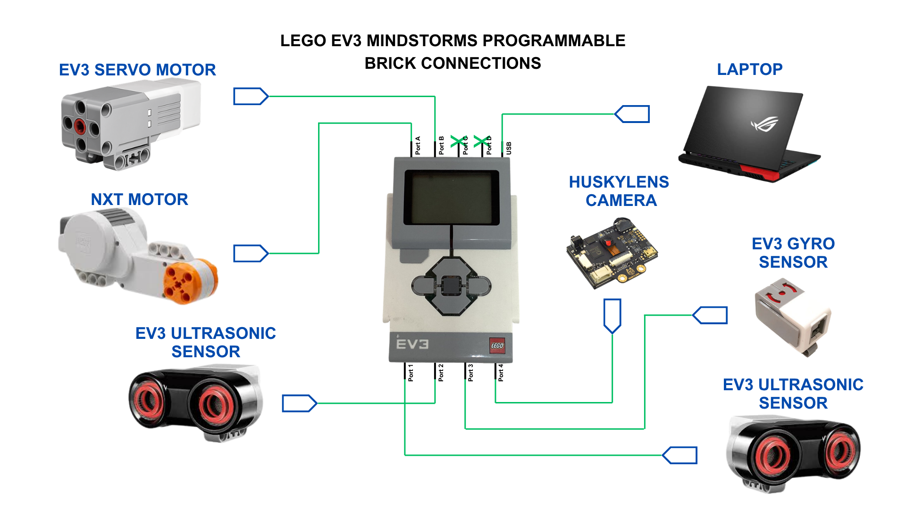
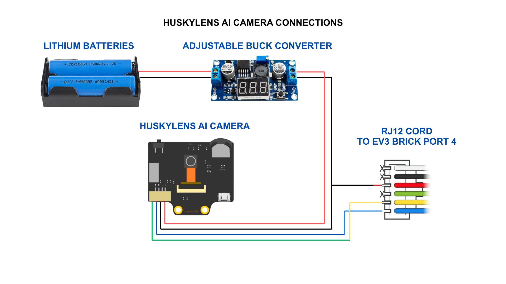

Electromechanical diagrams
====

This folder contains the electromechanical schematics used in the construction of our PRO Future Engineers 2026 robot.

---

## LEGO EV3 MINDSTORMS PROGRAMMABLE BRICK CONNECTIONS

This diagram illustrates the connections between the LEGO EV3 programmable brick and the various motors and sensors used by the robot, including the steering motor, drive motor, gyro sensor, and ultrasonic sensors.

  

*Figure 1. Connection diagram of the LEGO EV3 programmable brick and its connected components.*

---

## HUSKYLENS AI CAMERA CONNECTIONS

This diagram illustrates the electrical and communication connections used to integrate the HuskyLens AI camera with the EV3-based system, including an external power supply used to support the camera's operation.

  

*Figure 2. Connection diagram of the HuskyLens AI camera and its supporting circuitry.*

---

## Notes

The schematics in this folder are intended to document the robot's electrical architecture and provide a reference for understanding, reproducing, and maintaining the system.
