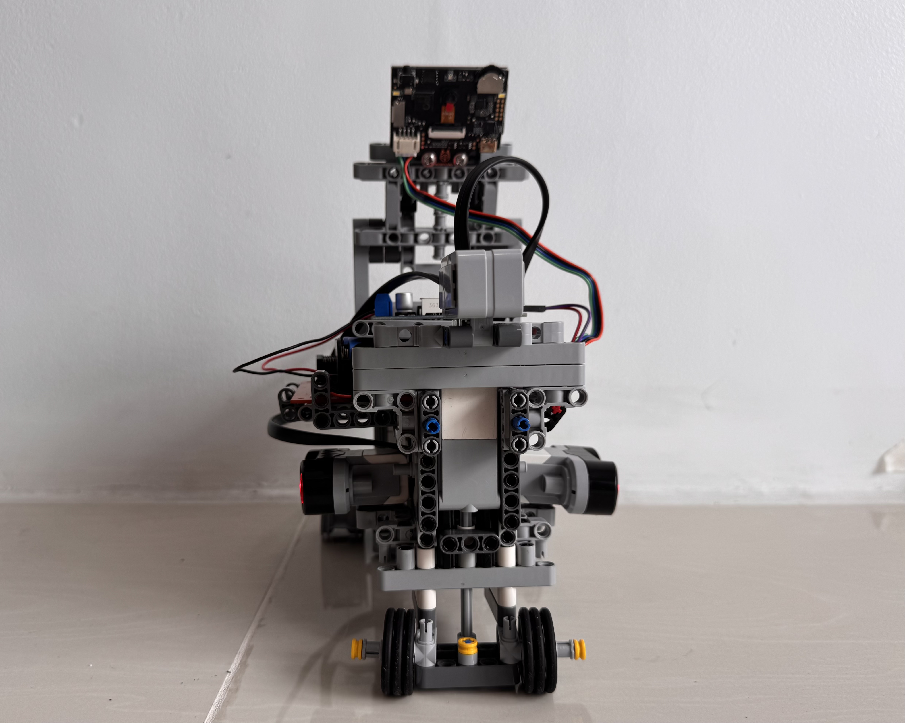
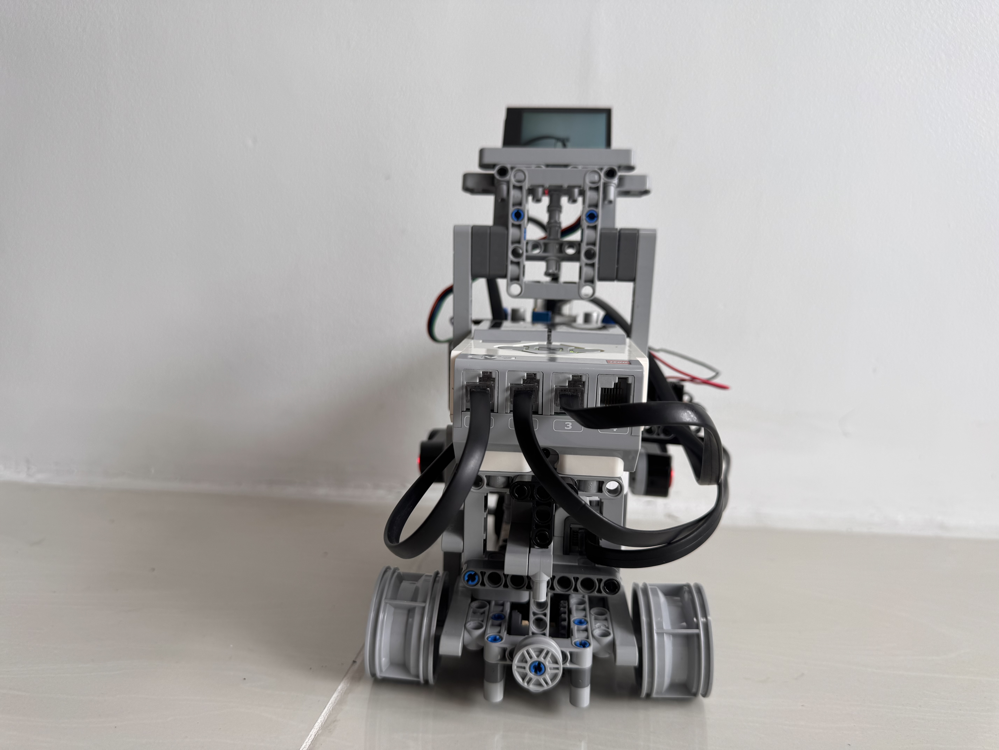
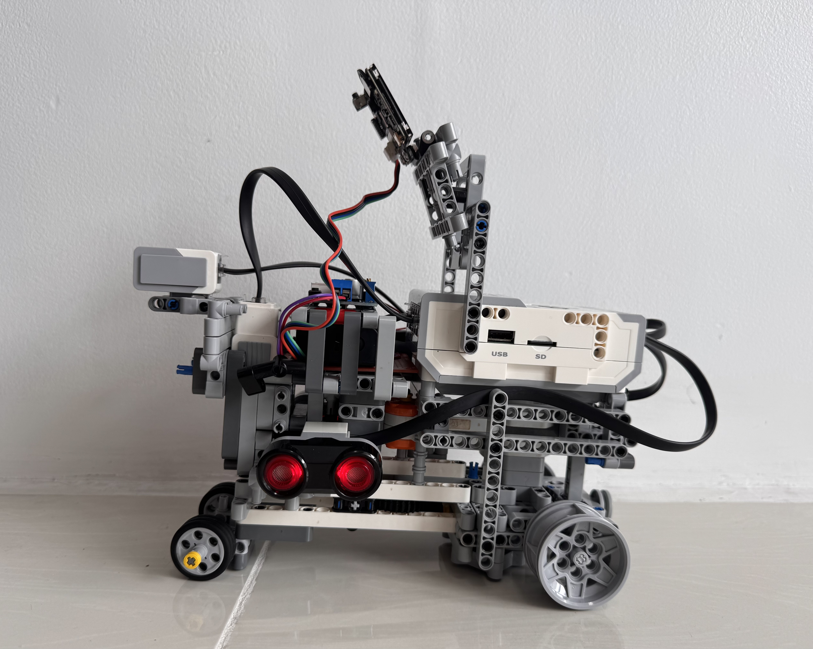
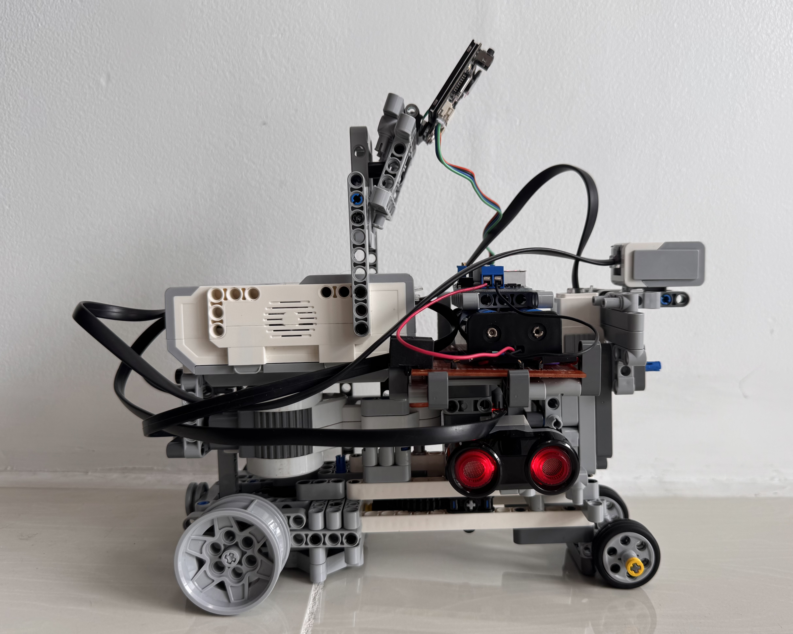
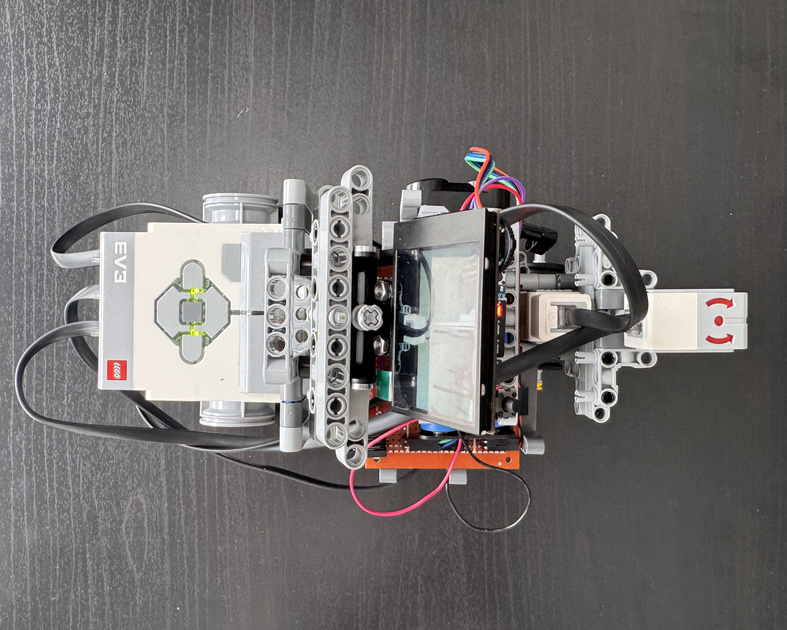
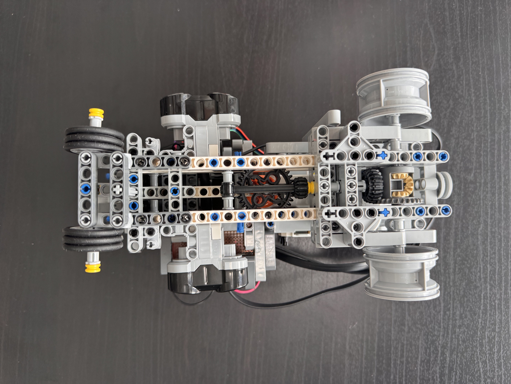

Vehicle's photos
====

This folder contains the six required photographs of the robot used in the PRO Future Engineers 2026 competition. The images document the final vehicle configuration from all major perspectives and provide a complete overview of its mechanical structure and component placement.

| View       | Image                              |
| ---------- | ---------------------------------- |
| Front      |   |
| Back       |    |

|  |  |
| :------------------------------: | :-------------------------------: |
|            Left Side             |             Right Side            |

| ---------- | ---------------------------------- |
| Top        |     |
| Bottom     |  |
